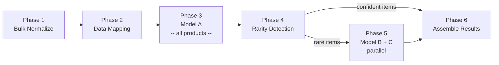
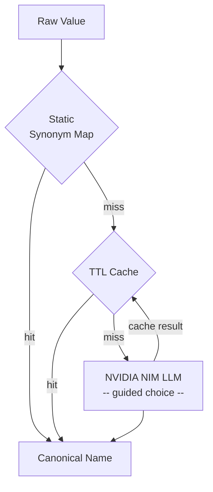

<div align="center">
  <h1>ESPResso Service</h1>
  <p><strong>NOTE: This is V1 of the ESPResso Service. A new version is currently in development and will be published soon.</strong></p>
  <hr>
  <p><strong>Carbon footprint prediction microservice for the Avelero Digital Product Passport platform</strong></p>
  <p>
    <a href="#getting-started"></a>
    <a href="#architecture"></a>
    <a href="#prediction-pipeline"></a>
    <a href="#docker-deployment"></a>
  </p>
</div>

## About

ESPResso Service is the production inference layer for the [ESPResso](README_model.md) carbon footprint prediction models. It wraps three trained model artifacts (A, B, and C) behind a FastAPI endpoint that accepts product IDs, fetches product data from Supabase, runs the 6-phase prediction pipeline, and writes results back -- all in a single request cycle.

The service is designed to integrate with the [Avelero](https://avelero.com) Digital Product Passport (DPP) platform, where brands submit products and receive per-product carbon footprint predictions decomposed into four life cycle components: raw materials, transport, processing, and packaging.

For the underlying model methodology -- LCA-phase generalization, synthetic data generation, and the three-model prediction architecture with meta-learning -- see [README_model.md](README_model.md).

## Table of Contents

- [About](#about)
- [Key Features](#key-features)
- [Architecture](#architecture)
  - [Project Structure](#project-structure)
  - [Pipeline Overview](#pipeline-overview)
  - [Normalization Flow](#normalization-flow)
- [API Reference](#api-reference)
  - [Health Check](#health-check)
  - [Predict](#predict)
  - [Authentication](#authentication)
- [Prediction Pipeline](#prediction-pipeline)
  - [Phase 1: Bulk Normalization](#phase-1-bulk-normalization)
  - [Phase 2: Data Mapping](#phase-2-data-mapping)
  - [Phase 3: Model A Prediction](#phase-3-model-a-prediction)
  - [Phase 4: Rarity Detection](#phase-4-rarity-detection)
  - [Phase 5: Ensemble Prediction](#phase-5-ensemble-prediction)
  - [Phase 6: Best Model Selection](#phase-6-best-model-selection)
- [Normalization System](#normalization-system)
  - [Three-Tier Resolution](#three-tier-resolution)
  - [Bulk Normalization Strategy](#bulk-normalization-strategy)
  - [Supported Normalizations](#supported-normalizations)
- [Configuration](#configuration)
- [Getting Started](#getting-started)
  - [Prerequisites](#prerequisites)
  - [Installation](#installation)
  - [Docker Deployment](#docker-deployment)
  - [Running Tests](#running-tests)
- [Scripts](#scripts)
- [Database Migrations](#database-migrations)
- [Contact](#contact)

## Key Features

- **Three-model ensemble with automatic routing** -- Model A (data-only meta-learner) runs on all products; Models B (reference-enriched) and C (formula-guided) are invoked only for rare or low-confidence items, with the best result selected by confidence score.

- **Intelligent normalization** -- Raw material names, product categories, and manufacturing steps are resolved through a three-tier system: static synonym maps (instant, free), in-memory TTL cache (fast, free), and NVIDIA NIM LLM fallback (accurate, token-cost).

- **Bulk normalization with deduplication** -- Unknown values are collected and deduplicated across all products in a batch, then resolved in at most 3 parallel NIM calls (one per column type). The LLM never sees product IDs or business data -- only raw value lists.

- **Integrated Supabase cycle** -- A single `POST /api/v1/predict` request fetches product data, runs predictions, and writes results back to the database. No intermediate orchestration required.

- **TTL caching** -- Normalization results are cached in-memory with configurable max size and TTL (default: 10,000 entries, 24-hour expiry) to minimize repeated LLM calls.

- **Rate-limit key rotation** -- Multiple NVIDIA NIM API keys can be configured for round-robin rotation with per-key 60-second cooldowns on 429 responses.

- **HMAC brand authorization** -- Prediction requests are verified via `X-Brand-Id` and `X-Brand-Signature` headers signed by the Avelero backend, ensuring only authorized brands can trigger predictions.

- **Per-IP rate limiting** -- Sliding window rate limiter with configurable request count and window size. Returns `429` with `Retry-After` and `X-RateLimit-*` headers. Health endpoints are exempt.

- **Structured request logging** -- All requests and responses logged via structlog with contextvar-based correlation for machine-parseable output in production.

- **Graceful degradation** -- Missing input fields produce warnings rather than errors; the pipeline applies sensible defaults so prediction proceeds with incomplete data.

## Architecture

### Project Structure

<details>
<summary>Directory layout</summary>

```
espresso-service/
+-- app/
|   +-- api/
|   |   +-- v1/
|   |   |   +-- schemas/
|   |   |   |   +-- request.py          # PredictRequest, ProductInput, MaterialInput
|   |   |   |   +-- response.py         # PredictionResult, PredictionSummary, etc.
|   |   |   +-- health.py              # GET /api/v1/health
|   |   |   +-- predict.py             # POST /api/v1/predict
|   |   +-- deps.py                    # FastAPI dependency injection
|   |   +-- router.py                  # Top-level API router
|   +-- middleware/
|   |   +-- api_key_auth.py            # Bearer token authentication
|   |   +-- brand_auth.py             # HMAC-based brand authorization
|   |   +-- rate_limiter.py           # Per-IP sliding window rate limiter
|   |   +-- request_logging.py        # Structured request/response logging
|   +-- models/
|   |   +-- loader.py                  # Model artifact loader (A, B, C)
|   |   +-- predictor.py              # Batch prediction with error isolation
|   +-- normalization/
|   |   +-- synonym_map.py            # Static material synonym dictionary (~220 entries)
|   |   +-- material_normalizer.py    # Material name normalization (static + NIM)
|   |   +-- category_normalizer.py    # Product category normalization
|   |   +-- step_normalizer.py        # Manufacturing step normalization
|   |   +-- nim_client.py             # NVIDIA NIM chat completions client
|   |   +-- nim_key_pool.py           # Round-robin API key pool with cooldowns
|   |   +-- cache.py                  # TTL+LRU normalization cache
|   +-- pipeline/
|   |   +-- orchestrator.py           # 6-phase batch pipeline coordinator
|   |   +-- bulk_normalizer.py        # Collect, deduplicate, resolve, patch
|   |   +-- data_mapper.py            # ProductInput -> ESPResso record dict
|   |   +-- batch_utils.py            # Batch chunking utilities
|   +-- supabase/
|   |   +-- client.py                 # Supabase PostgREST client
|   |   +-- product_fetcher.py        # Fetch product data for prediction
|   |   +-- result_writer.py          # Write predictions back to Supabase
|   +-- config.py                     # Pydantic Settings (all env vars)
|   +-- main.py                       # FastAPI app factory with lifespan
+-- espresso_models/
|   +-- model_a/                      # Primary model (data-only meta-learner)
|   +-- model_b/                      # Secondary model (reference-enriched ensemble)
|   +-- model_c/                      # Tertiary model (formula-guided hybrid)
+-- migrations/
|   +-- migrate.py                    # Migration runner (tracks in espresso_migrations table)
|   +-- 001_add_carbon_components.*   # product_carbon_predictions table
|   +-- 002_add_packaging_transport.* # transport distance + packaging tables
|   +-- 003_add_rls_policies.*        # Row-level security policies
+-- scripts/
|   +-- local_test.py                 # Interactive local testing (direct DB + models)
|   +-- batch_predict.py              # CLI batch prediction via API
+-- docs/
|   +-- AVELERO_CHANGES.md            # Avelero-specific integration notes
|   +-- gcloud-deployment.md          # Google Cloud deployment guide
+-- tests/                            # pytest test suite
+-- Dockerfile                        # Multi-stage build (Python 3.12-slim)
+-- docker-compose.yml                # Production service configuration
+-- pyproject.toml                    # Dependencies and build config
+-- start.sh                          # Local test runner with prerequisite checks
```

</details>

### Pipeline Overview

The prediction pipeline processes products in six phases, with Model A as the primary predictor and Models B and C as specialists for rare or low-confidence items.



### Normalization Flow

Raw input values pass through a three-tier resolution system before reaching the models. Only true unknowns -- values not found in static maps or cache -- trigger LLM calls.



## API Reference

### Health Check

```
GET /api/v1/health
```

Returns service health status including model load state, NIM reachability, cache statistics, and uptime. No authentication required.

**Response example:**

```json
{
  "status": "healthy",
  "models": {
    "A": true,
    "B": true,
    "C": true
  },
  "nim_reachable": true,
  "cache": {
    "size": 1247,
    "max_size": 10000,
    "hits": 8432,
    "misses": 1247
  },
  "uptime_seconds": 3621.4
}
```

| Field | Description |
|-------|-------------|
| `status` | `"healthy"` if all models loaded, `"degraded"` otherwise |
| `models` | Per-model load status (A, B, C) |
| `nim_reachable` | Whether the NVIDIA NIM endpoint is reachable |
| `cache` | Normalization cache size, capacity, and hit/miss counts |
| `uptime_seconds` | Seconds since service startup |

### Predict

```
POST /api/v1/predict
```

The unified prediction endpoint. Accepts product IDs, fetches data from Supabase, runs the 6-phase pipeline, writes results back, and returns predictions. Requires Bearer token authentication.

**Request body:**

```json
{
  "brand_id": "550e8400-e29b-41d4-a716-446655440000",
  "product_ids": [
    "6ba7b810-9dad-11d1-80b4-00c04fd430c8",
    "6ba7b811-9dad-11d1-80b4-00c04fd430c8"
  ],
  "confidence_threshold": 0.6
}
```

| Field | Type | Required | Description |
|-------|------|----------|-------------|
| `brand_id` | string | yes | UUID of the brand owning the products |
| `product_ids` | string[] | yes | Product UUIDs to predict (1--500) |
| `confidence_threshold` | float | no | Override rarity confidence threshold (0--1) |

**Response body:**

```json
{
  "predictions": [
    {
      "product_id": "6ba7b810-9dad-11d1-80b4-00c04fd430c8",
      "carbon_kg_co2e": 12.47,
      "components": {
        "raw_materials": 5.23,
        "transport": 2.81,
        "processing": 3.14,
        "packaging": 1.29
      },
      "confidence": 0.87,
      "model_used": "A",
      "is_rare": false,
      "warnings": [],
      "error": null
    }
  ],
  "summary": {
    "total_products": 2,
    "successful": 2,
    "failed": 0,
    "rare_count": 0,
    "avg_confidence": 0.87,
    "processing_time_seconds": 1.234
  },
  "failed_products": [],
  "db_write": {
    "written": 2,
    "skipped": 0
  }
}
```

| Field | Description |
|-------|-------------|
| `predictions` | Per-product results with carbon breakdown, confidence, and model attribution |
| `summary` | Aggregate statistics: total, successful, failed, rare count, average confidence, processing time |
| `failed_products` | Products that failed prediction with reason strings |
| `db_write` | Database write outcome (`null` if the write failed entirely) |

### Authentication

All prediction endpoints require a Bearer token matching the `API_KEY` environment variable:

```
Authorization: Bearer <your-api-key>
```

The health check endpoint does not require authentication.

## Prediction Pipeline

The orchestrator (`app/pipeline/orchestrator.py`) runs six phases sequentially, with parallelism within phases where possible.

### Phase 1: Bulk Normalization

Collects all unique unknown values across the entire batch -- material names, manufacturing steps, and product category roots -- and deduplicates them. Unknown values are those not found in static synonym maps or the normalization cache.

The deduplicated unknowns are then resolved in up to 3 parallel NVIDIA NIM calls (one per column type: materials, steps, categories). Results are stored in lookup tables and used to patch each product with canonical names.

The LLM never sees product IDs, brand data, or full product records -- only isolated lists of raw strings.

### Phase 2: Data Mapping

Each `ProductInput` is transformed into an ESPResso record dictionary matching the model input schema. Key transformations:

- Weight unit conversion (g, lb, oz to kg) with a default of 1.0 kg if missing
- Material weights computed as `total_weight * percentage / 100`
- Origin region fallback to the first material's country of origin
- Warnings generated for any missing or defaulted fields

### Phase 3: Model A Prediction

All products are run through Model A (the primary data-only meta-learner) via batch prediction in a background thread. Model A is designed for maximum robustness under incomplete data, using cross-validated statistical lookups and missing-feature masking.

Each record produces a prediction with four carbon components and a per-component confidence score.

### Phase 4: Rarity Detection

Products where Model A returned `None` (prediction failure) or whose overall confidence falls below `RARITY_CONFIDENCE_THRESHOLD` (default: 0.6) are flagged as **rare items**. Only rare items proceed to Phase 5.

### Phase 5: Ensemble Prediction

Rare items are re-predicted through Models B and C in parallel (if loaded):

- **Model B** (reference-enriched) -- better accuracy for rare materials because emission factors are available regardless of training frequency
- **Model C** (formula-guided) -- highest accuracy with complete data due to deterministic formula inductive bias

Both models run concurrently via `asyncio.gather` in background threads.

### Phase 6: Best Model Selection

For each product:

- **Non-rare items** -- Model A's result is used directly
- **Rare items** -- the model (A, B, or C) with the highest overall confidence score is selected

If all models fail for a product, a zero-confidence error result is produced with the reason. Final results include carbon component breakdowns, confidence scores, model attribution, rarity flags, and any warnings from data mapping.

## Normalization System

### Three-Tier Resolution

Raw material names, product categories, and manufacturing steps from user input rarely match the canonical ESPResso vocabulary exactly. The normalization system resolves them through three tiers in order:

1. **Static synonym maps** -- Hardcoded dictionaries mapping ~220 material synonyms, ~30 step types, and ~10 category roots to canonical names. Instant lookup, zero cost.

2. **TTL cache** -- In-memory LRU cache with configurable size and time-to-live. Stores previous NIM resolutions to avoid repeated LLM calls for the same raw values.

3. **NVIDIA NIM LLM** -- For true unknowns, the NIM client sends the raw value with a `guided_choice` constraint that forces the LLM to select from the exact canonical vocabulary. This guarantees valid output without post-processing.

### Bulk Normalization Strategy

Rather than normalizing each product independently (which could trigger hundreds of redundant NIM calls in a batch of 500 products), the bulk normalizer:

1. **Collects** unique unknown values across all products in the batch
2. **Deduplicates** -- if 200 products contain "organic cotton", it appears once in the NIM request
3. **Resolves** all unknowns per column type in a single NIM call (numbered list in, line-by-line parse out)
4. **Patches** each product using the resulting lookup tables

This reduces NIM calls from potentially `N * 3` (one per product per column) to at most **3** (one per column type), regardless of batch size.

### Supported Normalizations

| Column | Canonical Values | Static Map Size | Example |
|--------|------------------|-----------------|---------|
| Materials | 87 (EcoInvent + Agribalyse) | ~220 synonyms | "organic cotton" -> "fibre, cotton, organic" |
| Steps | ~30 processing steps | ~30 mappings | "stone washing" -> "washing" |
| Categories | 10 root categories | ~10 mappings | "Apparel" -> "Clothing" |

## Configuration

All configuration is loaded from environment variables (with `.env` file fallback) via Pydantic Settings. Validation runs at startup -- the service will not start with invalid or missing required values.

| Variable | Description | Required | Default |
|----------|-------------|----------|---------|
| `API_KEY` | Bearer token for endpoint authentication | yes | -- |
| `NIM_API_KEY` | Single NVIDIA NIM API key | yes (one of) | -- |
| `NIM_API_KEYS` | Comma-separated NIM keys for rotation (takes priority) | yes (one of) | -- |
| `NIM_MODEL_ID` | NIM model identifier | yes | -- |
| `NIM_BASE_URL` | NIM API base URL | yes | -- |
| `MODEL_A_PATH` | Path to Model A artifact (.pkl) | yes | -- |
| `MODEL_B_PATH` | Path to Model B artifact (.pkl) | yes | -- |
| `MODEL_C_PATH` | Path to Model C artifact (.pkl) | yes | -- |
| `RARITY_CONFIDENCE_THRESHOLD` | Confidence below which items are flagged as rare | yes | -- |
| `MAX_BATCH_SIZE` | Maximum products per request | yes | -- |
| `NIM_CONCURRENCY_LIMIT` | Max concurrent NIM requests | yes | -- |
| `CACHE_MAX_SIZE` | Normalization cache capacity | yes | -- |
| `CACHE_TTL_SECONDS` | Normalization cache TTL | yes | -- |
| `SUPABASE_URL` | Supabase project URL | yes | -- |
| `SUPABASE_SERVICE_KEY` | Supabase service role key | yes | -- |
| `HOST` | Server bind address | yes | -- |
| `PORT` | Server bind port | yes | -- |
| `LOG_LEVEL` | Logging level (debug, info, warning, error) | yes | -- |
| `ENVIRONMENT` | Runtime environment (`development` or `production`) | no | `development` |
| `HMAC_SECRET` | Shared secret for HMAC brand signature verification | yes | -- |
| `RATE_LIMIT_REQUESTS` | Max requests per IP per window | no | `100` |
| `RATE_LIMIT_WINDOW_SECONDS` | Sliding window size in seconds | no | `60` |
| `ALLOWED_ORIGINS` | Comma-separated CORS allowed origins | no | -- |
| `HEALTH_REQUIRE_AUTH` | Whether health endpoint requires authentication | no | `false` |

At least one of `NIM_API_KEY` or `NIM_API_KEYS` must be set. If both are provided, `NIM_API_KEYS` takes priority.

See [`.env.example`](.env.example) for a complete template with recommended defaults.

## Getting Started

### Prerequisites

- Python 3.11+
- Model artifacts (`model_a.pkl`, `model_b.pkl`, `model_c.pkl`) placed in an `artifacts/` directory
- NVIDIA NIM API key (for normalization LLM fallback)
- Supabase project with product data (for the integrated predict endpoint)

### Installation

```bash
git clone <repository-url>
cd espresso-service
python -m venv .venv && source .venv/bin/activate
pip install -e .
```

For development dependencies (pytest, etc.):

```bash
pip install -e ".[dev]"
```

For `scripts/local_test.py` (direct PostgreSQL access):

```bash
pip install -e ".[dev,db]"
```

Configure environment variables:

```bash
cp .env.example .env
# Edit .env with your API keys, Supabase credentials, and model paths
```

Start the development server:

```bash
uvicorn app.main:create_app --factory --reload
```

### Docker Deployment

The service ships with a multi-stage Dockerfile (Python 3.12-slim base) and a docker-compose configuration with a 4 GB memory limit, health checks, and automatic restart.

```bash
# Build and run
docker compose up --build

# Or run detached
docker compose up -d --build
```

The compose file mounts `./artifacts` as a read-only volume at `/app/artifacts` for model pickle files, and loads secrets from `.env`.

### Running Tests

```bash
pytest tests/
```

Tests use `asyncio_mode = "auto"` and should not depend on external services.

## Scripts

**`scripts/local_test.py`** -- Interactive end-to-end test that bypasses the API server. Connects directly to the Avelero PostgreSQL database, lets you select a brand, loads product data via raw SQL, normalizes materials using static synonym maps (no NIM), loads model artifacts directly, runs predictions with the meta-learner strategy, and renders results as text tables. Useful for validating model artifacts and data assembly without running the full service.

Run via the prerequisite-checking wrapper:

```bash
./start.sh
```

**`scripts/batch_predict.py`** -- CLI tool for production batch prediction. Supports `--brand-id`, `--product-ids`, `--missing-only`, `--dry-run`, and `--batch-size` flags. Reads product data from the database, sends batches to the running ESPResso service API, and writes results back to `product_environment` and `product_carbon_predictions` tables.

## Database Migrations

The service includes a migration system for Supabase schema changes, tracked in an `espresso_migrations` table with SHA-256 checksums for integrity verification.

**Check migration status:**

```bash
python -m migrations.migrate --status
```

**Apply pending migrations:**

```bash
python -m migrations.migrate
```

**Rollback a specific migration:**

```bash
python -m migrations.migrate --rollback 001_add_carbon_components
```

Current migrations:

| Migration | Description |
|-----------|-------------|
| `001_add_carbon_components` | Creates `product_carbon_predictions` table for full component breakdowns |
| `002_add_packaging_transport` | Adds `transport_distance_km` to journey steps, creates packaging tables |
| `003_add_rls_policies` | Enables row-level security on `product_carbon_predictions` |

## Contact

<p>
  <a href="mailto:moussa@avelero.com"></a>
  <a href="https://avelero.com"></a>
  <a href="https://www.linkedin.com/in/moussa-ouallaf/"></a>
</p>
