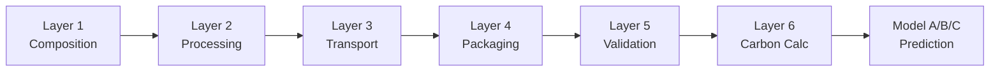

<div align="center">
  <h1>ESPResso</h1>
  <p><strong>ISO-aligned carbon footprint estimation through LCA-phase generalization and meta-learned model routing</strong></p>
  <p>
    <a href="#getting-started"></a>
    <a href="data/data_calculation"></a>
    <a href="#data-sources"></a>
    <a href="#data-sources"></a>
  </p>
</div>

## About

The textile and apparel industry faces mounting regulatory pressure to quantify and disclose product-level carbon footprints under emerging European Union sustainability frameworks. The EU Strategy for Sustainable and Circular Textiles, the Ecodesign for Sustainable Products Regulation (ESPR 2024), and the mandated Digital Product Passport (DPP) require manufacturers to provide accurate cradle-to-gate carbon footprint assessments for every textile product placed on the market. However, comprehensive life cycle assessment (LCA) data remains prohibitively expensive and time-intensive to collect across fragmented global supply chains -- particularly for small and medium enterprises lacking direct supplier engagement.

ESPResso (Environmental Sustainability Predictor for Regulatory Ecosystems and Supply-chain Optimization) addresses this through a hybrid LCA-probabilistic framework that fundamentally departs from conventional machine learning approaches. The system enforces deterministic life cycle calculations as the primary computational core, restricting probabilistic methods exclusively to data imputation under incomplete information regimes. This architecture ensures:

- **Full traceability** -- every emission component is decomposable by life cycle phase, satisfying regulatory verification requirements under ESPR and DPP.
- **Physical consistency** -- guaranteed by construction through ISO 14040/14044-aligned formulas, never violated by statistical artifacts.
- **Robust degradation** -- when input data is sparse, probabilistic imputation fills gaps in the input space; the deterministic formulas then compute the footprint. The models never predict emissions directly.

In practice, smaller companies often lack the complete set of input parameters required for deterministic LCA calculation -- material weights may be approximate, transport distances unknown, or processing steps only partially documented. ESPResso's gap-filling architecture addresses this by training ML models to predict these missing input values rather than predicting emissions directly. When a manufacturer provides incomplete product specifications, the probabilistic models impute the missing fields (estimated transport distance, likely processing steps, material weight distribution), and the deterministic formulas then compute the carbon footprint from the completed input vector. This guarantees that every prediction remains physically interpretable and decomposable by life cycle phase, regardless of how much data the user initially provides.

The methodology is rigorously aligned with ISO 14040/14044 standards and the Product Environmental Footprint Category Rules (PEFCR) for Apparel and Footwear version 3.1, approved by the European Commission in 2025.

## Table of Contents

- [About](#about)
- [Key Contributions](#key-contributions)
- [LCA-Phase Generalization Methodology](#lca-phase-generalization-methodology)
  - [ISO 14040/14044 and PEFCR v3.1](#iso-1404014044-and-pefcr-v31)
  - [Cradle-to-Gate System Boundary](#cradle-to-gate-system-boundary)
  - [Phase-by-Phase Generalization](#phase-by-phase-generalization)
  - [Material Database](#material-database)
  - [Master Equation](#master-equation)
- [Agent-Orchestrated Synthetic Data Pipeline](#agent-orchestrated-synthetic-data-pipeline)
  - [Layer 1: Product Composition Generator](#layer-1-product-composition-generator)
  - [Layer 2: Processing Path Generator](#layer-2-processing-path-generator)
  - [Layer 3: Transport Scenario Generator](#layer-3-transport-scenario-generator)
  - [Layer 4: Packaging Configuration Generator](#layer-4-packaging-configuration-generator)
  - [Layer 5: Validation and Correction Layer](#layer-5-validation-and-correction-layer)
  - [Layer 6: Carbon Footprint Calculation](#layer-6-carbon-footprint-calculation)
- [Three-Model Prediction Architecture with Meta-Learning](#three-model-prediction-architecture-with-meta-learning)
  - [Base Architecture](#base-architecture)
  - [Model A: Data-Only Ground-Up Learner](#model-a-data-only-ground-up-learner)
  - [Model B: Reference-Enriched Learner](#model-b-reference-enriched-learner)
  - [Model C: Formula-Guided Hybrid](#model-c-formula-guided-hybrid)
  - [Meta-Learner](#meta-learner)
- [Prediction Targets](#prediction-targets)
- [Repository Structure](#repository-structure)
- [Getting Started](#getting-started)
- [Data Sources](#data-sources)
- [Contact](#contact)
- [Acknowledgments](#acknowledgments)

## Key Contributions

1. **LCA-Phase Generalization Methodology** -- Systematic analysis proving which life cycle phases permit secondary data substitution under ISO 14040/14044 and PEFCR v3.1, with deterministic formulas for each generalizable phase.

2. **Agent-Orchestrated Synthetic Data Pipeline** -- A 6-layer, LLM-driven pipeline that generates ~100K physically consistent training records from product taxonomies, addressing the scarcity of public LCA datasets in textiles.

3. **Three-Model Prediction Architecture with Meta-Learning** -- Models spanning the spectrum from pure data-driven to formula-guided, unified by a shared meta-learner that provides threshold-free confidence scoring and intelligent model routing based on data completeness and input rarity.

## LCA-Phase Generalization Methodology

### ISO 14040/14044 and PEFCR v3.1

The ISO 14040/14044 framework establishes the foundational principles for life cycle assessment: representativeness, consistency, and transparency. It does not mandate primary data collection for every process -- secondary data is explicitly permitted when primary data is unavailable, provided the secondary sources are scientifically grounded, transparent in their derivation, and compliant with the standard's data quality requirements.

The Product Environmental Footprint Category Rules (PEFCR) for Apparel and Footwear version 3.1, endorsed by the European Commission, operationalizes these principles for the textile sector. It defines mandatory methodology for EU-market products, specifies the Data Needs Matrix (DNM) and Data Quality Rating (DQR) requirements for secondary data acceptability, and establishes the system boundary and allocation procedures that ESPResso implements.

Together, these standards provide the legal and scientific basis for generalizing life cycle phases using secondary emission factor databases rather than requiring facility-specific primary measurements for every product.

### Cradle-to-Gate System Boundary

According to ISO 14040 and ISO 14044, all stages included within the defined system boundary must be systematically tracked and accounted for. A complete life cycle typically encompasses raw material acquisition, production, use, and end-of-life treatment. However, in a restricted system boundary such as cradle-to-gate, only the upstream phases up to the factory gate are included. This restricted boundary is widely applied in the textile industry.

The following life cycle stages are included:

1. **Raw material acquisition and extraction** -- types, quantities, and extraction energy for all raw materials
2. **Upstream transport of raw materials** -- all modes of transport delivering materials from source through intermediate steps to the manufacturing facility
3. **Material processing and pre-processing** -- energy and material inputs to convert raw materials into usable intermediates (spinning, weaving, dyeing, finishing, tanning, etc.)
4. **Manufacturing and production** -- absorbed into processing (see below); no separate calculation required
5. **Packaging of the finished product** -- type, quantity, and production impact of packaging materials
6. **Internal transport and logistics** -- in-plant movement, storage, handling, and associated utilities
7. **Emissions, waste, and by-product management** -- all environmental outputs up to the factory gate

### Phase-by-Phase Generalization

The core scientific contribution is identifying which of these phases can be mathematically generalized when client-specific primary data is unavailable, and the precise conditions under which such generalization is permitted.

#### Raw Material Acquisition

ISO 14040/14044 permits generalization when primary data are unavailable, provided that secondary data are transparent, scientifically sourced, and compliant with the PEFCR Data Needs Matrix (DNM) and Data Quality Rating (DQR) requirements. The standards emphasize representativeness, consistency, and transparency rather than absolute precision.

The emission factor for each material is looked up from EcoInvent 3.12 or Agribalyse 3.2 (see [Material Database](#material-database)). The formula:

$$CF_{\text{raw}} = \sum_{i} w_i \cdot EF_i$$

where $w_i$ is the mass of material $i$ in kg and $EF_i$ is the emission factor in kgCO2e/kg from the reference database.

#### Upstream Transport

Transport mode selection is generalized using a multinomial logit model calibrated against European freight transport research (Delft University of Technology) and validated against industry benchmark data. Rather than assuming a fixed transport mode, the model calculates the probability of each mode as a function of distance and uses these probabilities to compute a distance-weighted emission factor.

The base transport formula:

$$CF_{\text{transport}} = \frac{w}{1000} \cdot D \cdot \frac{EF_{\text{weighted}}(D)}{1000}$$

where $w$ is shipment weight in kg, $D$ is distance in km, and $EF_{\text{weighted}}(D)$ is the probability-weighted emission factor in gCO2e/tkm.

**Mode-level emission factors** (weighted averages across subtypes):

| Mode | EF (gCO2e/tkm) |
|------|-----------------|
| Road | 72.9 |
| Rail | 22.0 |
| Inland waterway | 31.0 |
| Sea | 10.3 |
| Air | 782.0 |

These are derived from subtype-level factors weighted by usage share. For example, road combines diesel articulated HGV >33t (74 gCO2e/tkm), HGV 3.5-33t at 100% laden (67.63), and generic academic LCA road freight (78). Sea combines deep-sea container ship (8.4) and short-sea container ship (16). Air combines long-haul freighter (560) and belly freight (990).

**Probability calculation.** The probability of using mode $m$ at distance $D$:

$$P_m(D) = \frac{\exp(U_m(D))}{\sum_k \exp(U_k(D))}$$

where the utility (attractiveness) of each mode is:

$$U_m(D) = \beta_{0m} + \beta_{1m} \cdot \ln(D)$$

Road is the reference mode with $U_{\text{road}}(D) = 0$. The beta coefficients are derived from empirical freight transport research (de Jong and Ben-Akiva, 2021) calibrated against European transport statistics. Sea and air coefficients were additionally validated against industry benchmark data.

**Weighted emission factor.** The distance-dependent weighted emission factor:

$$EF_{\text{weighted}}(D) = \sum_m P_m(D) \cdot EF_m$$

This ensures that at short distances, road dominates (high probability); at medium distances, rail and inland waterway gain share; at long distances, sea and air dominate -- matching observed freight transport patterns.

#### Material Processing

For each material in the product, the system identifies all valid processing steps by cross-referencing against the EcoInvent processing steps database (11 textile-specific steps covering fibre preparation, yarn production, fabric formation, wet processing, and leather processing). Only steps that are both valid for the material and consistent with the user-provided manufacturing journey are included.

This conservative approach -- enumerating all applicable material-process combinations -- ensures that the carbon footprint is never underestimated, complying with the precautionary principle embedded in ISO 14040/14044.

$$CF_{\text{processing}} = \sum_{m} \sum_{p} w_m \cdot EF_{m,p}$$

where $w_m$ is the mass of material $m$, $EF_{m,p}$ is the emission factor for processing step $p$ applied to material $m$, and the inner sum runs over all applicable processing steps for that material.

**Available processing steps** (from EcoInvent 3.12):

- Fibre preparation: scouring, carding, combing
- Yarn production: spinning (ring, open-end, air-jet)
- Fabric formation: weaving, knitting
- Wet processing: dyeing, bleaching, printing, finishing
- Leather processing: tanning (chrome, vegetable)

**Data source separation.** Raw materials may come from either EcoInvent or Agribalyse, but all processing steps are exclusively sourced from EcoInvent. This is methodologically sound because:

- Agribalyse provides cradle-to-farm-gate data (e.g., wool from sheep farming, hides from slaughterhouse)
- EcoInvent provides gate-to-gate data for industrial transformations (e.g., wool scouring, yarn spinning)
- These are additive and non-overlapping, preventing double-counting per ISO 14040/14044

**Combination database.** All valid material-process combinations (87 materials x applicable steps) are pre-computed and stored as a lookup table for the C calculation layer.

#### Manufacturing and Production

This phase is already fully covered by the material processing calculations. All valid combinations of materials and their corresponding processing steps include the energy-related impacts of manufacturing. A separate calculation is therefore redundant.

#### Packaging

Packaging uses a material-based approach with category-level emission factors derived from EcoInvent:

$$CF_{\text{packaging}} = \sum_{i} m_i \cdot EF_i$$

where $m_i$ is the mass of packaging material $i$ and $EF_i$ is the category emission factor.

| Material Category | Count | Avg Accuracy (%) | Emission Factor (kgCO2e/kg) |
|-------------------|-------|-------------------|------------------------------|
| Paper/Cardboard | 6 | 87.5 | 1.3 |
| Plastic | 7 | 81.4 | 3.5 |
| Glass | 2 | 85.0 | 1.1 |
| Other/Unspecified | 2 | 87.5 | 2.5 |

Accuracy rates are based on EcoInvent data quality indicators (description specificity, presence of quality markers such as "intermediate exchange" or "market activity").

#### Internal Logistics and Waste Management

Internal transport and in-plant logistics contribute less than 1% of total cradle-to-gate impact in textile LCAs, as they are dominated by raw material production, processing, and manufacturing energy use. Many averaged secondary datasets already implicitly include these flows. Similarly, emissions, waste, and by-product management typically account for less than 1% of total impact.

Each is represented by a fixed 1% additive proxy (combined 2% uplift), conservative by design. This is explicitly permitted under ISO 14044 cut-off criteria and PEFCR aggregation principles when primary data are unavailable and the impact is demonstrably immaterial.

### Material Database

The material database was constructed through systematic integration of two complementary LCI databases, covering 87 base materials with transparent gap analysis.

#### EcoInvent 3.12

The primary source for emission factors. EcoInvent (version 3.12, Cutoff System Model) was queried programmatically using SQL against the underlying Derby database structure. From 14,201 total flows (3,344 classified as PRODUCT_FLOW), 53 fashion-relevant base materials were identified across eight material classes:

| Material Class | Count |
|----------------|-------|
| Textiles (woven fabrics, nonwovens) | 7 |
| Yarns (cotton, viscose, nylon, PET, PP) | 5 |
| Fibres (natural and synthetic) | 15 |
| Polymers (PA, PET, PP, PVC, etc.) | 7 |
| Rubber and elastomers | 5 |
| Foams (PUR, latex) | 4 |
| Metals (steel, aluminium, brass, zinc) | 8 |
| Natural materials (cork, coconut) | 2 |
| **Total from EcoInvent** | **53** |

**Coverage gaps identified:** leather and hides (only processing available, not raw production), down and feathers, specialty animal fibres (cashmere, alpaca, mohair, angora), elastane/spandex, and raw sheep wool (only processed products available).

#### Agribalyse 3.2

To address coverage gaps, supplementary data was sourced from Agribalyse 3.2 (ADEME), an agricultural LCA database providing cradle-to-farm-gate emission factors. From 21,089 product flows, 34 fashion-relevant raw materials were extracted:

| Material | Source Description | Flows |
|----------|--------------------|-------|
| Sheep wool | Organic and conventional, at farm gate (FR) | 11 |
| Beef/Lamb hides | Hides at slaughterhouse (FR/GB) | 6 |
| Duck/Chicken feathers | Feathers at slaughterhouse (FR) | 4 |
| Hemp fibre | Raw hemp fibre, without processing (FR) | 2 |
| Flax straw | Flaxseed straw / linen precursor (FR) | 1 |
| Seed cotton | Cotton ginning (BD/IN/RoW) | 10 |
| **Total from Agribalyse** | | **34** |

#### Integration Methodology

The two databases cover non-overlapping scopes, preventing double-counting:

1. **Raw material selection** -- the system queries EcoInvent first; if no match is found, Agribalyse is used as fallback.
2. **Processing step assignment** -- exclusively from EcoInvent, since Agribalyse covers agricultural production only.
3. **Combined calculation** -- additive: $CF_{\text{material\_total}} = CF_{\text{raw\_material}} + \sum CF_{\text{processing\_step\_p}}$.

For example, a wool fabric uses Agribalyse for farm-gate wool emissions, then EcoInvent for scouring, spinning, and weaving -- each from the appropriate scope boundary.

**Remaining gaps** (neither database covers): cashmere, alpaca, mohair, silk, elastane/spandex, goose down. Integration with the Higg Materials Sustainability Index (Higg MSI) is recommended as a future improvement for complete textile fibre coverage.

**Combined total: 87 base materials** (53 EcoInvent + 34 Agribalyse).

### Master Equation

The total cradle-to-gate carbon footprint:

$$CF_{\text{total}} = \left( CF_{\text{raw}} + CF_{\text{processing}} + CF_{\text{transport}} + CF_{\text{packaging}} \right) \times 1.02$$

The 1.02 multiplier accounts for internal logistics (1%) and waste management (1%).

## Agent-Orchestrated Synthetic Data Pipeline

Real LCA data for textiles is scarce, expensive, and often proprietary. ESPResso generates synthetic training data through a 6-layer agent-orchestrated pipeline, where each layer's output feeds the next and LLMs ensure realistic variation within physical constraints.



| Layer | Purpose | Records | Model |
|-------|---------|---------|-------|
| 1 | Product composition generation | 13,834 | Nemotron Ultra 253B |
| 2 | Processing path enumeration | 14,339 | Nemotron Ultra 253B |
| 3 | Transport scenario generation | 67,858 | Nemotron Super 49B |
| 4 | Packaging configuration | 101,966 | Nemotron Super 49B |
| 5 | Multi-stage validation | inline | Nemotron Ultra 253B + Nemotron 70B Reward |
| 6 | Carbon footprint calculation | 101,966 | C99 deterministic |

### Layer 1: Product Composition Generator

**Model:** NVIDIA Llama-3.1-Nemotron-Ultra-253B-v1
**System prompt:** [`data/data_generation/layer_1/prompts/prompts.py`](data/data_generation/layer_1/prompts/prompts.py)

Generates realistic product compositions using the clothing taxonomy as the starting point. Each product is linked to a high-level category and a more specific subcategory. The subcategory is the primary factor guiding material selection -- for example, within Coats (cl-1), subcategories like Trench Coats (cl-1-1), Winter Coats (cl-1-4), and Down Coats (cl-1-6) require fundamentally different materials.

The model receives the full set of 87 materials from the combined reference database and generates realistic combinations appropriate for the given subcategory, including material weights (kg) and percentages.

**Example output:**
```
category_id: cl-1, category_name: Coats
subcategory_id: cl-1-6, subcategory_name: Down Coats
materials: ["Polyester Fabric", "Duck Down Filling", "Nylon Lining"]
material_weights_kg: [0.88, 0.56, 0.16]
material_percentages: [55, 35, 10]
total_weight_kg: 1.6
```

### Layer 2: Processing Path Generator

**Model:** NVIDIA Llama-3.1-Nemotron-Ultra-253B-v1
**System prompt:** [`data/data_generation/layer_2/prompts/prompts.py`](data/data_generation/layer_2/prompts/prompts.py)

Systematically enumerates all valid preprocessing pathways for each material composition from Layer 1. Takes as input the material compositions and a predefined dataset specifying all valid processing steps per material, then generates all feasible combinations.

Each single Layer 1 record expands into multiple Layer 2 records, each representing a distinct preprocessing pathway.

**Context requirements:** The material-process combinations lookup alone requires approximately 145,000-180,000 tokens. Nemotron Ultra 253B was selected for its structured reasoning capability and reliability in generating consistent JSON output for manufacturing pathway generation.

### Layer 3: Transport Scenario Generator

**Model:** NVIDIA Llama-3.3-Nemotron-Super-49B-v1.5
**System prompt:** [`data/data_generation/layer_3/prompts/prompts.py`](data/data_generation/layer_3/prompts/prompts.py)

Generates context-aware transport scenarios for each preprocessed product configuration. For each Layer 2 record, the model generates 5 plausible total transport distances based on inferred production geographies -- evaluating where raw materials are typically sourced, where processing is likely to occur, and how these locations influence overall transport requirements.

Each Layer 2 record expands into multiple Layer 3 records, each representing a distinct transport scenario with a different yet plausible total transport distance. This captures variability in global supply chain logistics while remaining consistent with material composition and processing context.

### Layer 4: Packaging Configuration Generator

**Model:** NVIDIA Llama-3.3-Nemotron-Super-49B-v1.5
**System prompt:** [`data/data_generation/layer_4/prompts/prompts.py`](data/data_generation/layer_4/prompts/prompts.py)

Generates realistic packaging configurations based on the full contextual information: subcategory, material composition, preprocessing steps, and transport characteristics. The model evaluates how these factors jointly influence packaging requirements (protection needs, weight considerations, handling constraints).

Each input record is expanded into one or more outputs representing distinct yet realistic packaging configurations from the four material categories (Paper/Cardboard, Plastic, Glass, Other/Unspecified) with associated masses.

### Layer 5: Validation and Correction Layer

**Models:** NVIDIA Llama-3.1-Nemotron-Ultra-253B-v1 (semantic) + NVIDIA Llama-3.1-Nemotron-70B-Reward (quality scoring)
**Validation logic:** [`data/data_generation/layer_5/core/semantic_validator.py`](data/data_generation/layer_5/core/semantic_validator.py)

The quality gate of the pipeline, implementing a five-stage validation system that classifies records as **accepted** (production-ready), **review** (requires manual inspection), or **rejected** (data quality failures).

**Stage 1: Deterministic Validation** -- Code-based checks independent of AI models:
- Material composition: database existence, weight/percentage sum consistency (1% tolerance), array length matching, positive values
- Preprocessing paths: step existence in reference dataset, valid material-step combinations (rejects impossible combinations like "leather spinning"), duplicate detection
- Transport: distance range enforcement (500-25,000 km), supply chain type matching, positive distances
- Packaging: category validation against emission factor database, mass sum consistency, packaging-to-product weight ratio (typically 2-15%)
- ID uniqueness: collision prevention across records

**Stage 2: Semantic Validation** -- AI-driven coherence evaluation using Nemotron Ultra 253B across five dimensions (each scored 0-1): material-product coherence, preprocessing-material coherence, transport-supply chain coherence, packaging-product coherence, and overall realism. Thresholds: 0.85+ (accept), 0.70-0.85 (review), below 0.70 (reject).

**Stage 3: Reward Scoring** -- Quality scoring using Nemotron 70B Reward. Score interpretation: 0.80+ (high quality), 0.60-0.80 (acceptable), below 0.60 (flag for review).

**Stage 4: Statistical Validation** -- Distribution monitoring and outlier detection: MD5-based deduplication (95% similarity threshold for near-duplicates), distribution tracking to prevent mode collapse, and outlier flagging (3 sigma for weight, 2 sigma for packaging ratio, 2.5 sigma for transport distance).

**Stage 5: Decision Logic and Correction** -- Combines all validation results:
```
REJECT if: critical deterministic errors, duplicate record, or semantic "reject"
REVIEW if: statistical outlier, distribution violation, semantic "review", or reward < 0.60
ACCEPT if: plausibility >= 0.85, no major issues, all deterministic checks passed
```

**Correction mechanism** for minor fixable issues:
- Percentage normalization: if material percentages sum to 98-102%, proportionally adjusted to 100%
- Weight reconciliation: individual weights scaled to match total_weight_kg
- Distance clamping: values outside 500-25,000 km clamped to nearest boundary
- Category normalization: variant names mapped to standard categories (e.g., "Cardboard" to "Paper/Cardboard")

Corrected records are flagged with `is_corrected=true` with original values preserved for audit.

### Layer 6: Carbon Footprint Calculation

**Implementation:** C99 deterministic calculation
**Source:** [`data/data_generation/layer_6/`](data/data_generation/layer_6/)

The final deterministic calculation layer, implemented in C for computational efficiency. Takes validated records from Layer 5 and applies all formulas from the methodology section.

**Component calculations:**

1. **CF_raw:** Each material weight multiplied by its emission factor from the 87-material reference database. Matching uses exact name lookup with fuzzy fallback (Levenshtein ratio >= 0.6).

2. **CF_transport:** Multinomial logit probabilities calculated per-record to produce distance-weighted emission factors, then applied with the transport formula.

3. **CF_processing:** Materials matched to applicable preprocessing steps using the material-process combinations lookup table.

4. **CF_packaging:** Category-level emission factors applied (Paper/Cardboard 1.3, Plastic 3.5, Glass 1.1, Other/Unspecified 2.5 kgCO2e/kg).

5. **CF_total:** Sum of all components multiplied by 1.02 adjustment.

**Output schema** (extends input with calculated fields):
```
cf_raw_materials_kg_co2e       -- Raw material acquisition emissions
cf_transport_kg_co2e           -- Upstream transport emissions
cf_processing_kg_co2e          -- Material processing emissions
cf_packaging_kg_co2e           -- Packaging emissions
cf_modelled_kg_co2e            -- Sum of four components
cf_adjustment_kg_co2e          -- 2% adjustment (logistics + waste)
cf_total_kg_co2e               -- Final cradle-to-gate footprint
transport_mode_probabilities   -- JSON object with mode shares
calculation_timestamp          -- ISO 8601 timestamp
calculation_version            -- Pipeline version identifier
```

**Results:** The pipeline produced 101,966 records with carbon calculations. After final cleanup removing 4,371 rows with unknown transport strategies, the training dataset contains 97,595 records.

## Three-Model Prediction Architecture with Meta-Learning

### Base Architecture

All three model variants share the same foundational architecture:

- **Four independent LightGBM gradient-boosted decision tree ensembles**, one per carbon footprint component: raw materials, transport, processing, and packaging. Each ensemble predicts its component independently.
- **Log-space training** using log1p/expm1 transforms to handle the heavy-tailed emission distributions and stabilize gradient descent.
- **Missing-feature masking strategy** with 6 feature groups masked with probability 0.15 during training. At each training step, entire feature groups are randomly zeroed out, forcing the model to learn redundant pathways and degrade gracefully when real-world inputs are incomplete.
- **A meta-learner** for per-component confidence scoring (see [Meta-Learner](#meta-learner)).
- **Two aggregate targets** ($CF_{\text{modelled}}$ and $CF_{\text{total}}$) derived deterministically from the four component predictions using the master equation -- never predicted directly.

### Model A: Data-Only Ground-Up Learner

Designed for companies that lack most input data. Uses only data-derived features (~404 features across 11 groups) including cross-validated statistical lookups: category-level emission medians, material frequency encodings, processing step co-occurrence statistics, distance-bin aggregates, and weight-class summaries. No reference tables or formulas are used at any point.

**Strength:** Maximum robustness under missing features. The masking strategy ensures graceful degradation -- when entire input categories are absent, the model falls back on cross-validated statistical proxies rather than failing.

**Weakness:** Lower accuracy ceiling, since the model must discover physical relationships (e.g., that heavier materials produce more emissions) from data patterns alone. Accuracy also declines for rare or underrepresented product types because the cross-validated statistical lookups are sparse when few training examples exist for a given category.

### Model B: Reference-Enriched Learner

Extends Model A with ~77 reference-derived features that internalize emission factor lookups from EcoInvent and Agribalyse. The key feature `sum_material_ef_weighted` directly approximates the $CF_{\text{raw}}$ deterministic formula by multiplying each material weight by its database emission factor and summing. Additional reference features include per-material emission factors, packaging category emission factors, and continental grouping encodings.

**Strength:** Better at handling rare materials because the reference emission factor is available regardless of how frequently the material appeared in training. Higher accuracy ceiling when reference data is available.

**Weakness:** Steeper degradation when inputs are missing. The reference-derived features carry significant predictive weight, and their absence is more disruptive than losing purely statistical features.

### Model C: Formula-Guided Hybrid

Two-stage architecture:

- **Stage 1:** Computes deterministic formula outputs using the exact C-module equations -- transport multinomial logit mode probabilities, material emission factor lookups, processing step energy calculations, and packaging emission factor application.
- **Stage 2:** Trains a LightGBM residual corrector on the gap between formula output and ground truth, learning systematic biases and interaction effects that the deterministic formulas cannot capture.

**Strength:** Highest accuracy with complete data. Handles rare data points best because the formulas provide strong inductive bias even for unseen material combinations -- if a material has an emission factor, the formula produces a reasonable estimate regardless of training frequency. Provides transparent per-phase decomposition.

**Weakness:** Most brittle when inputs are missing. The deterministic stage requires specific inputs (material weights, transport distances, processing steps) to produce meaningful outputs. When these are absent, the formula outputs degenerate and the residual corrector has little to work with.

### Meta-Learner

Predicts per-component Absolute Percentage Error (APE) as a continuous regression target (clipped to [0, 2.0] to prevent outlier distortion). For each of the four carbon footprint components and each model variant, the meta-learner estimates how large the prediction error is likely to be.

The meta-learner does not make routing decisions itself. It returns a set of signals describing how rare or uncertain the input data is: material rarity scores, processing step rarity, category-origin combination counts, and feature-group completeness indicators. These signals enable a downstream routing architecture where the system dynamically selects between models -- Model C for complete, common inputs where it excels; Model A for rare or sparse inputs where its graceful degradation is critical; Model B as a middle ground when reference data is available but some inputs are missing.

## Prediction Targets

| Target | Description | Unit |
|--------|-------------|------|
| `cf_raw_materials_kg_co2e` | Raw material acquisition | kg CO2e |
| `cf_processing_kg_co2e` | Material processing and manufacturing | kg CO2e |
| `cf_transport_kg_co2e` | Upstream transportation | kg CO2e |
| `cf_packaging_kg_co2e` | Packaging production | kg CO2e |
| `cf_total_kg_co2e` | Total cradle-to-gate footprint | kg CO2e |

## Repository Structure

<details>
<summary>Directory layout</summary>

```
espresso/
+-- data/
|   +-- data_generation/          # 6-layer synthetic data pipeline
|   |   +-- layer_1/              # Product composition (LLM-generated)
|   |   +-- layer_2/              # Processing path enumeration
|   |   +-- layer_3/              # Transport scenario generation
|   |   +-- layer_4/              # Packaging configuration
|   |   +-- layer_5/              # Validation (deterministic + semantic + statistical)
|   |   +-- layer_6/              # Carbon calculation (C implementation)
|   |   +-- shared/               # Common API clients, parallel processing
|   |   \-- scripts/              # Pipeline run scripts
|   +-- data_calculation/         # Legacy C calculation module
|   |   +-- src/                  # Source: raw_materials, transport, processing, packaging
|   |   +-- include/              # Headers
|   |   \-- Makefile
|   \-- datasets/
|       +-- pre-model/            # Pipeline outputs and reference databases
|       |   +-- final/            # Reference CSVs (materials, taxonomy, processing steps)
|       |   +-- generated/        # Layer outputs (Parquet, gzip)
|       |   \-- secondary_datasets/  # EcoInvent + Agribalyse raw data (24GB, gitignored)
|       +-- model/                # Model-specific splits and references
|       \-- scripts/              # Data extraction, analysis, splitting utilities
+-- model/
|   +-- model_a/                  # Data-only ground-up learner
|   |   +-- features/             # Feature engineering (Groups 1-4, cross-link)
|   |   +-- preprocessing/        # Data cleaning and encoding
|   |   +-- training/             # Training loop and configuration
|   |   +-- evaluation/           # Metrics and analysis
|   |   +-- meta_learner/         # Per-model confidence scoring
|   |   \-- notebooks/            # Exploratory analysis
|   +-- model_b/                  # Reference-enriched learner (same structure)
|   +-- model_c/                  # Formula-guided hybrid (same structure)
|   \-- model_designs/            # Architecture design documents
+-- docs/                         # LaTeX research paper
\-- .env                          # API keys and configuration (gitignored)
```

</details>

## Getting Started

### Prerequisites

- Python 3.10+
- GCC or Clang (C99 support)
- NVIDIA API key (for LLM-based data generation layers)

### Installation

```bash
git clone https://github.com/your-org/espresso.git
cd espresso
python -m venv .venv && source .venv/bin/activate
pip install -r requirements.txt
```

Configure API keys in `.env`:

```bash
cp .env.example .env
# Edit .env with your NVIDIA API key
```

### Build the C Calculation Layer

```bash
cd data/data_calculation
make clean && make all
```

### Run the Data Generation Pipeline

```bash
python data/data_generation/scripts/run_full_pipeline.py
```

## Data Sources

**EcoInvent 3.12** (Cutoff System Model) -- 14,201 total flows, 53 fashion-relevant materials covering textiles, yarns, fibres, polymers, rubber, foams, metals, and natural materials. Provides gate-to-gate processing emission factors.

**Agribalyse 3.2** (ADEME) -- 21,089 product flows, 34 supplementary agricultural materials including wool, hides, feathers, hemp, flax, and cotton. Provides cradle-to-farm-gate emission factors.

The two databases cover non-overlapping scopes (agricultural production vs. industrial processing), preventing double-counting when combined.

## Contact

<p>
  <a href="mailto:moussa@avelero.com"></a>
  <a href="https://avelero.com"></a>
  <a href="https://www.linkedin.com/in/moussa-ouallaf/"></a>
</p>

## Acknowledgments

- **ISO 14040/14044** -- Life cycle assessment framework and requirements guiding the generalization methodology
- **PEFCR for Apparel and Footwear v3.1** -- Product category rules defining phase boundaries and data quality requirements
- **EcoInvent** -- Swiss Centre for Life Cycle Inventories
- **Agribalyse** -- ADEME (French Environment and Energy Management Agency)
- **NVIDIA Nemotron** model family for synthetic data generation
